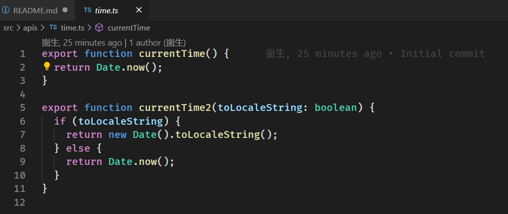

# 一个简简单单的 TypeScript RPC 解决方案

> 有时候不需要什么「分布式」，前后端「项目分离」。
>
> 只是想可以方便调用一个接口、不去写接口文档、还有有完善的方法类型提示而已。
>
> 何必那么复杂呢。......
>
> 这里提供超轻量级的远程调用，完备的类型提示！

[codesandbox 体验地址](https://codesandbox.io/s/github/2234839/typescript_RPC_demo?utm_medium=plugin&file=/src/rpc.ts) codesandbox 的类型提示还不太行，本地开发是没有问题的

[demo  github 地址](https://github.com/2234839/typescript_RPC_demo)

下面是效果演示



#### 0x00 服务端方法

```typescript
// apis/time.ts
export function currentTime() {
  return Date.now();
}

export function currentTime2(toLocaleString: boolean) {
  if (toLocaleString) {
    return new Date().toLocaleString();
  } else {
    return Date.now();
  }
}
```

这里随便写了几个方法

#### 0x01 聚合

```typescript
// apis/index.ts
export * from "./time";
```

约定俗称的用一个 `index.ts` 文件将其他文件中的方法聚合起来。

#### 0x02 Remote Procedure Call !

Remote Procedure Call 要说的高大上呢那也有很多可以做的细节，但我们追求简简单单。

```typescript
// router/rpc.ts
import * as apis from "../apis";

export async function post(req: any, res: any) {
  const data = [] as any[];
  req.on("data", function (chunk) {
    data.push(chunk);
  });
  req.on("end", async () => {
    const { method, data: _data } = JSON.parse(data.join(""));
    const result = await apis[method](..._data);
    res.writeHead(200, {
      "Content-Type": "application/json"
    });
    res.end(JSON.stringify(result));
  });
}
```

简单的远程调用只需要暴露一个接口让用户可以调用本机方法就行了

#### 0x03 TypeScript ! 🎉

```typescript
//  rpc.ts
/** ═════════🏳‍🌈 超轻量级的远程调用，完备的类型提示！ 🏳‍🌈═════════  */
import type * as apis from "./apis";
type apis = typeof apis;
type method = keyof apis;

/** Remote call ， 会就近的选择是远程调用还是使用本地函数 */
export function RC<K extends method>(
  method: K,
  data: Parameters<apis[K]>
): Promise<unPromise<ReturnType<apis[K]>>> {
  if (typeof window !== "undefined") {
    // 客户端运行
    return fetch("/rpc", {
      method: "POST",
      body: JSON.stringify({ method, data }),
      headers: {
        "content-type": "application/json"
      }
    }).then((r) => r.json());
  } else {
    // 服务端运行，使用 import 的原因是避免 apis 的代码被打包发送到客户端
    return import("./apis/index").then(async (r: any) => {
      return await r[method](...data);
    });
  }
}

/** 解开 promise 类型包装 */
declare type unPromise<T> = T extends Promise<infer R> ? R : T;

// 示例 1 直接使用 RC

RC("currentTime", []).then((r) => console.log("服务器当前时间", r));
RC("currentTime2", [true]).then((r) => console.log("服务器当前时间本地化", r));

/** 包装了一次的 RC 方便跳转到函数定义  */
export const API = new Proxy(
  {},
  {
    get(target, p: method) {
      return (...arg: any) => RC(p, arg);
    }
  }
) as apisPromiseify;

/** apis 中包含的方法可能不是返回 promise 的，但 RC 调用后的一定是返回 promsie */
type apisPromiseify = {
  readonly [K in keyof apis]: (
    ...arg: Parameters<apis[K]>
  ) => Promise<unPromise<ReturnType<apis[K]>>>;
};

// 示例 2 通过 API 对象调用对应方法，这里的优点是可以直接跳转到对应函数的源码处

API.currentTime().then((r) => console.log("服务器当前时间", r));
API.currentTime2(true).then((r) => console.log("服务器当前时间本地化", r));

```

上面就是一顿类型操作，打完收工。

接下来无论是在服务端还是客户端通过 RC 或 API 来调用方法获得的体验是一模一样的。

并且通过 API 对象调用对应方法，这里的优点是可以直接跳转到对应函数的源码处。啥类型提示都有，接口文档也没有必要了。

追求简单的方法，完善类型体验。

> by 崮生 from [崮生 • 一些随笔](https://shenzilong.cn/record/%E6%AF%8F%E6%97%A5%E6%80%BB%E7%BB%93/2020/11%E6%9C%88.html) 🎨
>
> 本文欢迎分享与聚合，全文转载未经授权（ [联系我](https://shenzilong.cn/%E5%85%B3%E4%BA%8E/%E7%94%B3%E5%AD%90%E9%BE%99.html#%E6%88%91%E7%9A%84%E8%81%94%E7%B3%BB%E6%96%B9%E5%BC%8F)）不许可。
